

  

<h3 align="center">QuotesPal</h3>

A React Native app for managing book quotes, creating customizable quote designs, and sharing them with
communities in-app, functioning as a social media platform for quotes  

## Under Development...

  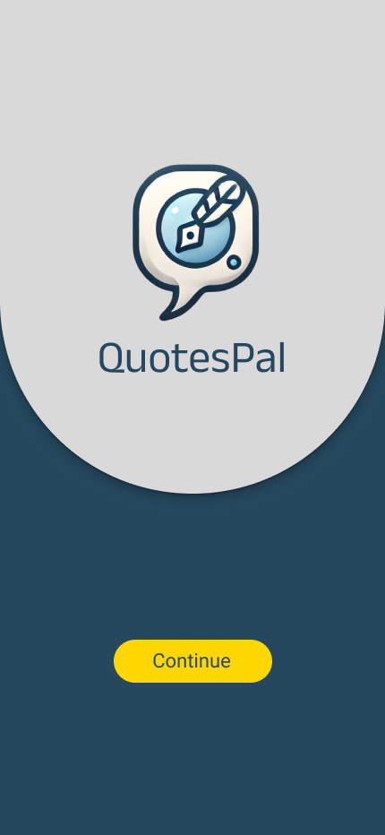
  
  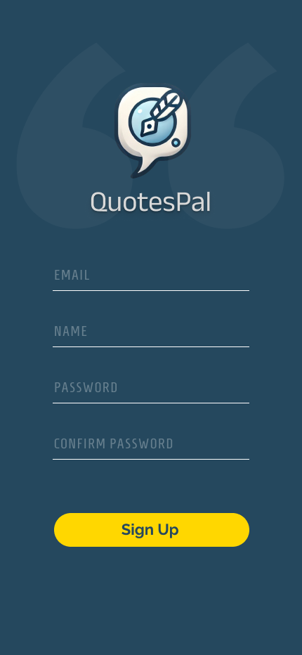
  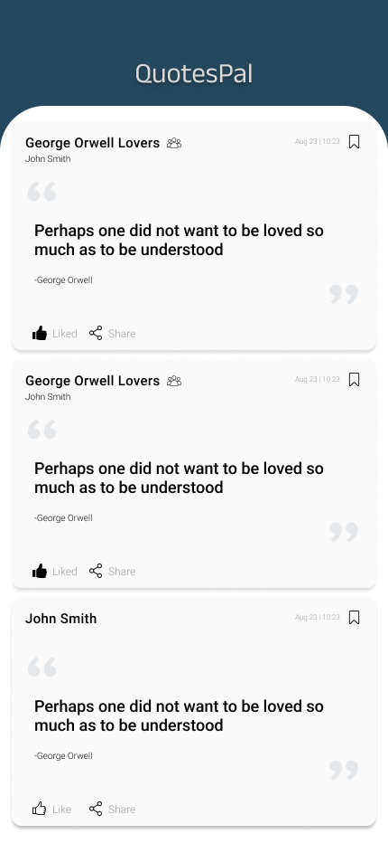
  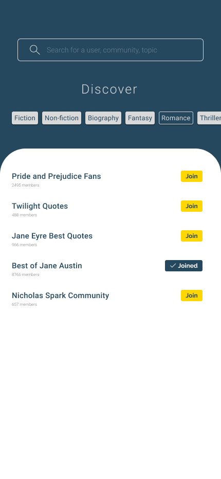
  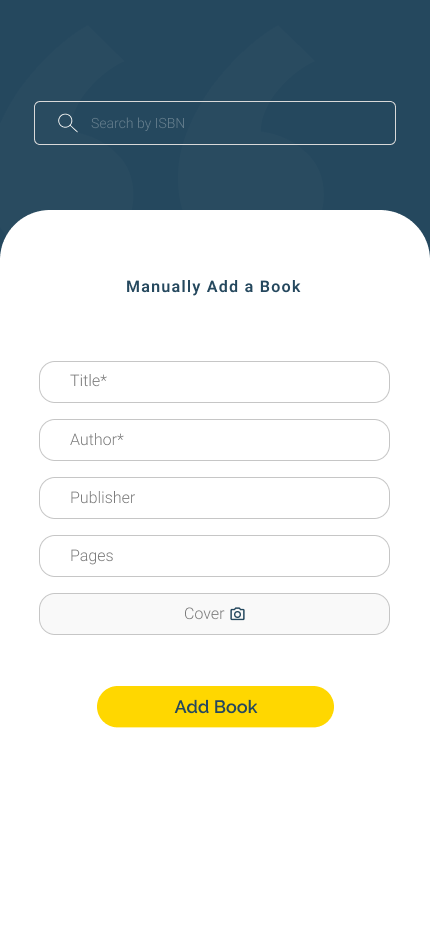
  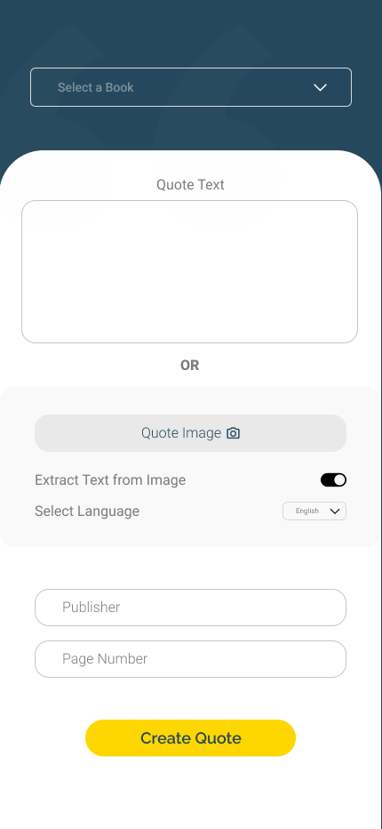
  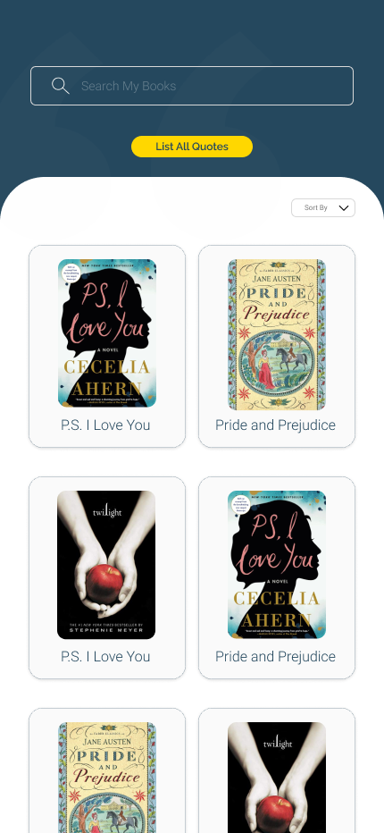
  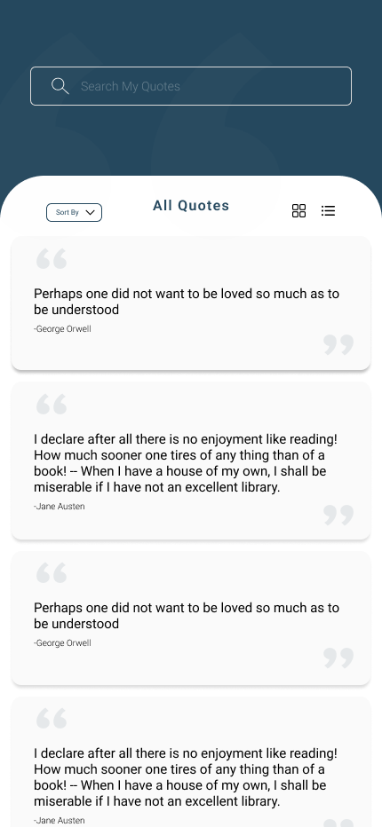
  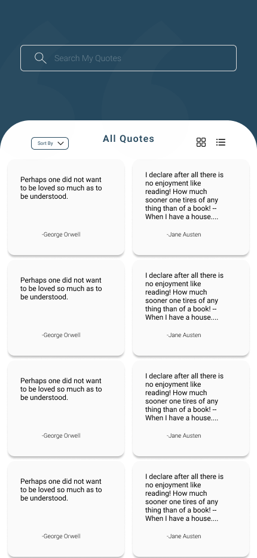
  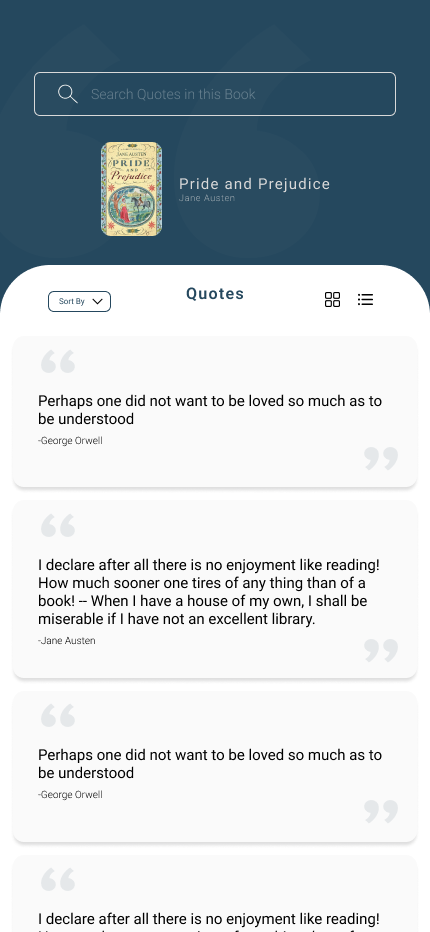
  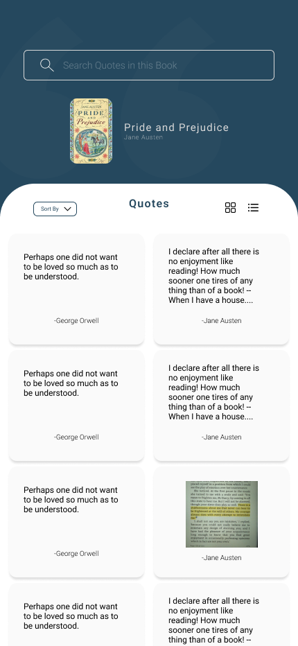
  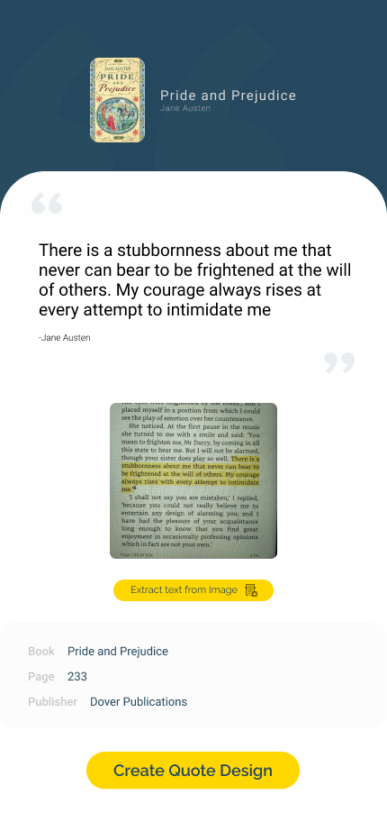
  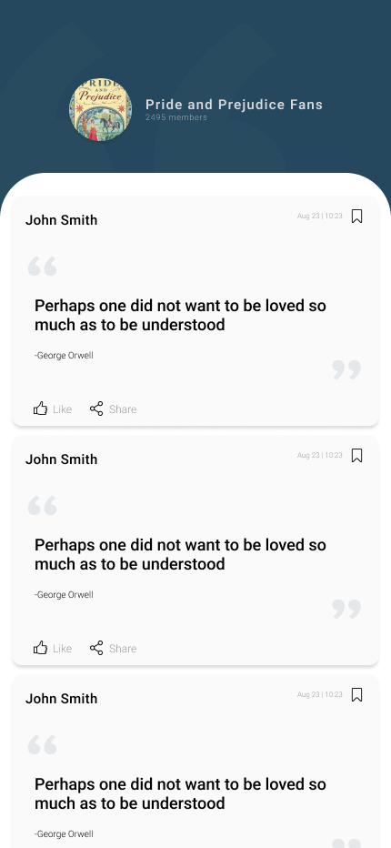
  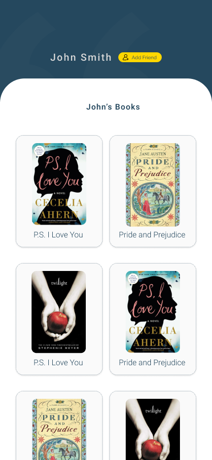
  

